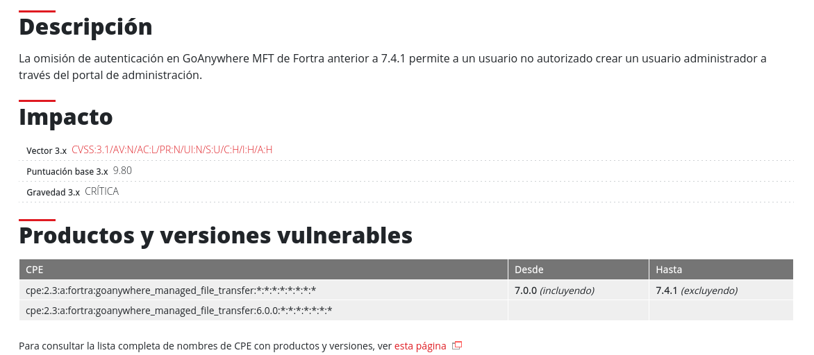
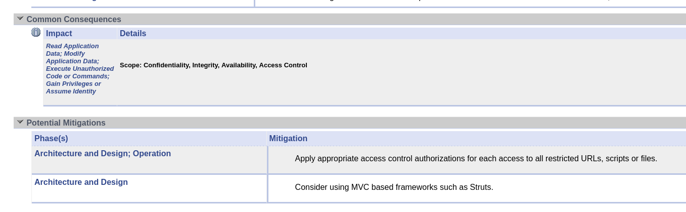

# Trazado de Vulnerabilidad: GoAnywhere MFT de Fortra

### Actualización de la Vulnerabilidad

En esta primera captura vemos la actualización publicada el 25 de enero de 2024. Lo importante aquí es que **Fortra informó a INCIBE que la vulnerabilidad CVE-2024-0204 fue resuelta con un parche el 7 de diciembre de 2023**. Esto nos dice que es un problema serio que ya tiene solución disponible.

---

## 2. Información General de la Vulnerabilidad

### Datos Básicos

En esta imagen se ve información de la Fortra sobre la vulnerabilidad. Podemos observar:

- **FI-2024-001**: Este es el identificador que Fortra le da a la vulnerabilidad 
- **Severidad**: Crítica
- **Fecha de Publicación**: 22-Ene-2024
- **CVE**: CVE-2024-0204

También vemos que hay una referencia con etiquetas: **Acceso no autorizado**, **Actualización**, **Ciberseguridad** y **Vulnerabilidad**, lo que nos ayuda a clasificar este problema.

---

## 3. Descripción de la Vulnerabilidad

### ¿Qué es lo que falla?

En esta captura vemos la descripción del problema. Lo que entiendo es:

**"La omisión de autenticación en GoAnywhere MFT de Fortra anterior a 7.4.1 permite a un usuario no autorizado crear un usuario administrador a través del portal de administración"**

Esto significa que **alguien sin permiso podía entrar al panel de control y crear una cuenta de administrador sin necesidad de contraseña o credenciales válidas**. Es muy grave porque un administrador tiene control total del sistema.

En la tabla también vemos:
- Versiones afectadas desde **6.0.0 hasta 7.4.1** 
- **Vector CVSS**: 9.8 
- **Gravedad**: CRÍTICA

---

## 4. Información del CVE

### Datos en la Base de Datos CVE

Aquí vemos la información del CVE-2024-0204 en la base de datos oficial:

- **Severity**: Critical
- **Published Date**: 22-Jan-2024 
- **Updated Date**: 22-Jan-2024
- **Vulnerabilities**: CVE-2024-0204

La información confirma que es crítica y fue publicada hace poco tiempo.

---

## 5. Debilidades Explotadas (CWE)

### Primera Captura de Debilidades

Aquí vemos las relaciones de las debilidades:

- **CWE-288**: "Authentication Bypass Using an Alternate Path or Channel" - Esto es lo principal, que se puede saltarse la autenticación
- **CWE-424**: "Improper Protection of Alternate Path" - La ruta alternativa no está bien protegida
- **CWE-862**: "Missing Authorization" - Falta de autorización

### Segunda Captura de Debilidades

En esta segunda captura vemos más debilidades relacionadas:

- **CWE-98**: Sobre inclusión remota de archivos 
- **CWE-471**: Modificación de datos que se suponía que no podían cambiar
- **CWE-417**: Errores en canales de comunicación
- **CWE-1212**: Errores de autorización

Lo importante es que la mayoría señalan problemas con **autenticación y autorización**, que es el núcleo del problema.

---

## 6. Patrones de Ataque (CAPEC)

### Cómo se explota la vulnerabilidad

En esta captura vemos el patrón de ataque CAPEC:

- **ID**: 416
- **Nombre**: "Manipulate Human Behavior"
- **Categoría**: Social Engineering 
- **Dominios**: Social Engineering
- **Mecanismos**: Engage in Deceptive Interactions

Lo interesante es que aunque parece que es ingeniería social, lo que realmente sucede es que **se manipula el comportamiento del sistema para que haga algo que no debería**.

Se mencionan relaciones con otras debilidades como:
- **CWE-416**: Manipulate Human Behavior 
- **CWE-288**: Authentication Bypass
- **CWE-424**: Improper Protection
- **CWE-862**: Missing Authorization

---

## 7. Análisis de Impacto

Esta vulnerabilidad afecta a:

| Área | Impacto |
|------|---------|
| **Confidencialidad** | Afectada - Se puede leer información del sistema |
| **Integridad** | Afectada - Se pueden modificar datos |
| **Disponibilidad** | Afectada - Se puede tomar control del sistema |
| **Control de Acceso** | Comprometido - Cualquiera puede ser administrador |

---

## 9. Conclusión

Esta vulnerabilidad es **muy grave** porque permite a cualquiera acceder como administrador sin necesidad de contraseña. Afecta a todas las versiones de GoAnywhere MFT desde la 6.0.0 hasta la 7.4.0, pero ya tiene solución: actualizar a la 7.4.1 o aplicar los parches indicados.