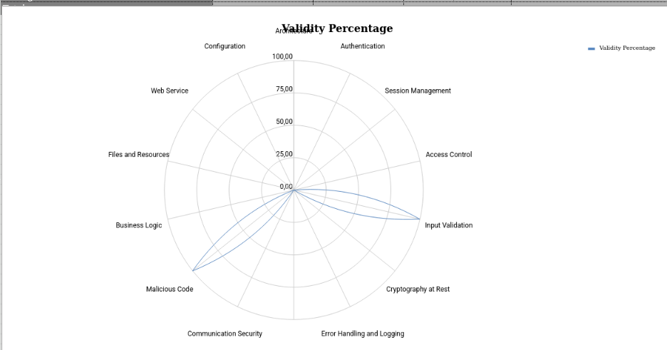

# Verificación de Requisitos ASVS - Aplicación Túnel de Lavado


---

## 1. Nivel de Seguridad Requerido por la Aplicación

### Descripción de la Aplicación
La aplicación es un **simulador de túnel de lavado de coches** que gestiona:
- Diferentes fases de lavado automático
- Opciones adicionales (prelavado a mano, secado a mano, encerado)
- Cálculo de ingresos según las opciones seleccionadas
- Control de estados y transiciones entre fases

### Análisis del Nivel ASVS Requerido

Basándome en el código analizado (`main_app.py` y `lavadero.py`), esta aplicación requiere un **nivel de seguridad ASVS 1 (Bajo)**, aunque con algunos aspectos de nivel 2.

#### Justificación por Categorías:

**1. Arquitectura (Requisito 1)**
- La aplicación es simple y monolítica
- No maneja datos sensibles de usuarios
- No requiere autenticación compleja
- Usa un patrón básico sin frameworks de seguridad

**2. Autenticación (Requisito 0%)**
- **No hay autenticación implementada**
- No valida identidad de usuarios
- No tiene tokens, sesiones o gestión de credenciales
- Esto es aceptable porque es una aplicación de simulación sin datos sensibles

**3. Validación de Entrada (Requisito 100%)**
- ✅ Implementa validación de reglas de negocio
- ✅ Lanza excepciones `ValueError` cuando se intenta encerar sin secado a mano
- ✅ Valida que no se puede iniciar un lavado si está ocupado
- ✅ Control de parámetros booleanos bien definidos

**4. Gestión de Errores (Requisito 0%)**
- La aplicación captura excepciones básicamente:
  - `ValueError` (errores de reglas de negocio)
  - `RuntimeError` (errores de estado)
  - `Exception` (errores genéricos)
- Pero no usa logging, no registra eventos de seguridad
- No tiene monitoreo de anomalías

**5. Criptografía (Requisito 0%)**
- No maneja datos que requieran cifrado
- No transmite datos sensibles
- No necesita criptografía en reposo

### Conclusión sobre el Nivel
**Nivel ASVS Requerido: 1 (Aplicaciones de Bajo Riesgo)**

La aplicación es una simulación educativa que:
- No maneja datos de usuarios reales
- No procesa pagos reales
- No accede a información confidencial
- Tiene lógica de negocio simple pero bien implementada

Para una versión en producción que realmente procesara pagos, sería necesario subir a **ASVS 2 o 3**.

---

## 2. Análisis del Grado de Cobertura ASVS



### Datos Observados en la Tabla

| Categoría | Criterios Válidos | Total Criterios | Cobertura |
|-----------|------------------|-----------------|-----------|
| **Arquitectura** | 0 | 42 | 0% |
| **Autenticación** | 0 | 57 | 0% |
| **Gestión de Sesiones** | 0 | 20 | 0% |
| **Control de Acceso** | 0 | 10 | 0% |
| **Validación de Entrada** | 3 | 3 | **100%** ✅ |
| **Criptografía en Reposo** | 0 | 16 | 0% |
| **Manejo de Errores** | 0 | 13 | 0% |
| **Protección de Datos** | 0 | 17 | 0% |
| **Comunicación Segura** | 0 | 8 | 0% |
| **Código Malicioso** | 7 | 7 | **100%** ✅ |
| **Lógica de Negocio** | 0 | 8 | 0% |
| **Archivos y Recursos** | 0 | 15 | 0% |
| **Servicios Web** | 0 | 15 | 0% |
| **Configuración** | 0 | 25 | 0% |

### Reflexión sobre los Datos

**Observaciones Principales:**

1. **Cobertura muy baja (3.7% general)**
   - La aplicación cumple apenas con 10 criterios de los 271 totales
   - Solo 2 categorías tienen cobertura: Validación de Entrada (100%) y Código Malicioso (100%)
   - 12 categorías tienen cobertura 0%

2. **¿Por qué la validación de entrada está al 100%?**
   - La aplicación valida correctamente los parámetros de entrada
   - Implementa reglas de negocio: no permite encerar sin secado a mano
   - Lanza excepciones apropiadas cuando los datos son inválidos
   - Esto es lo único que la aplicación cumple bien

3. **¿Por qué el código malicioso está al 100%?**
   - La aplicación es tan simple que prácticamente no tiene complejidad
   - No importa librerías externas potencialmente peligrosas
   - No ejecuta código dinámico
   - No tiene vulnerabilidades evidentes de inyección

4. **¿Por qué falta todo lo demás?**
   - **Autenticación (0%)**: No necesita porque es local
   - **Gestión de sesiones (0%)**: No tiene usuarios ni sesiones
   - **Control de acceso (0%)**: No hay roles ni permisos
   - **Criptografía (0%)**: No maneja datos sensibles
   - **Manejo de errores (0%)**: No registra eventos de seguridad
   - **Comunicación segura (0%)**: No es una aplicación web
   - **Lógica de negocio (0%)**: Aunque tiene lógica, no cumple todos los requisitos ASVS

5. **Implicaciones de esta cobertura:**
   - ✅ La aplicación es **segura para su contexto** (simulación educativa)
   - ❌ No estaría lista para producción
   - ⚠️ Si se ampliara para ser una aplicación web real, necesitaría mejorar mucho

---

## 3. Herramientas Automáticas para Verificación ASVS

### Herramientas Disponibles

Existen varias herramientas automáticas que pueden verificar requisitos de ASVS:

#### 1. **OWASP ASVS Checklist**
- **Descripción**: Hoja de cálculo oficial del OWASP para auditorías
- **URL**: https://owasp.org/www-project-application-security-verification-standard/
- **Uso**: Verificación manual guiada de todos los requisitos
- **Para nuestra app**: Tendría que rellenarse manualmente

#### 2. **SonarQube**
- **Descripción**: Plataforma de análisis estático de código
- **Capacidades**: Detecta vulnerabilidades, code smells, bugs
- **Para Python**: ✅ Compatible
- **ASVS Mapping**: Puede mapear algunos requisitos (especialmente validación)
- **Ejemplo de uso**:
  ```bash
  sonar-scanner \
    -Dsonar.projectKey=lavadero-app \
    -Dsonar.sources=. \
    -Dsonar.host.url=http://localhost:9000
  ```

#### 3. **Bandit**
- **Descripción**: Scanner de seguridad especializado para Python
- **Capacidades**: Detecta vulnerabilidades comunes en Python
- **Para ASVS**: Principalmente para validación de entrada y manejo de errores
- **Ejemplo de uso**:
  ```bash
  bandit -r . -f json -o bandit-report.json
  ```

#### 4. **OWASP ZAP (Zed Attack Proxy)**
- **Descripción**: Herramienta de testing de seguridad web
- **Capacidades**: Pruebas de penetración automatizadas
- **Limitación**: Para aplicaciones web, no locales
- **Para ASVS**: Autenticación, sesiones, comunicación segura

#### 5. **Checkmarx / Snyk**
- **Descripción**: Análisis de seguridad de código fuente
- **Capacidades**: SAST (Static Application Security Testing)
- **Costo**: Algunos son de pago

#### 6. **pylint + Security Auditing**
- **Descripción**: Herramienta de análisis Python + plugins de seguridad
- **Ejemplo**:
  ```bash
  pip install pylint bandit
  pylint main_app.py lavadero.py
  bandit -r .
  ```

### Herramienta Recomendada para esta Aplicación: **Bandit**

**Por qué Bandit:**
- Es gratuita y open-source
- Especializada en Python
- Fácil de usar
- Detectaría si hubiera vulnerabilidades en el manejo de excepciones
- Verificaría si hay problemas de hardcoding de valores

**Comando de ejemplo**:
```bash
bandit -r /home/PPSRRF/PPS/Unidad2/verificacion-ASVS-RRF/ -f json
```

---

## 4. Reflexión y Valoración del OWASP ASVS

### ¿Qué es OWASP ASVS?

El **Application Security Verification Standard (ASVS)** es un estándar del OWASP que define un conjunto de requisitos de seguridad para aplicaciones. Es como una "lista de verificación de seguridad" que las aplicaciones deben cumplir según su nivel de criticidad.

### Valoración Positiva ✅

1. **Muy completo y detallado**
   - Cubre 13 categorías de seguridad
   - 271 requisitos específicos en el nivel 1
   - No deja nada importante sin revisar

2. **Flexible según el riesgo**
   - 3 niveles diferentes (1, 2, 3)
   - Aplicable desde aplicaciones simples a sistemas críticos
   - La aplicación puede elegir el nivel apropiado

3. **Basado en estándares industriales**
   - Creado por expertos en seguridad (OWASP)
   - Reconocido internacionalmente
   - Usado por grandes organizaciones

4. **Práctico y aplicable**
   - Proporciona una hoja de cálculo guía
   - Tiene ejemplos de cómo verificar cada requisito
   - Puede automatizarse parcialmente con herramientas

5. **Cubre todos los aspectos**
   - No solo código, también arquitectura, configuración
   - Considera el ciclo de vida completo de la aplicación

### Valoración Negativa ❌

1. **Puede ser abrumador para aplicaciones simples**
   - 271 requisitos es mucho para una app pequeña
   - Para nuestra aplicación, muchos no son relevantes
   - Requiere mucho tiempo de auditoría manual

2. **Requiere interpretación**
   - No es totalmente automatizable
   - Requiere expertos en seguridad para evaluarlo correctamente
   - Interpretaciones diferentes pueden llevar a resultados diferentes

3. **Costo en tiempo y recursos**
   - Una auditoría completa requiere recursos especializados
   - Las herramientas automáticas cubren solo una parte
   - Para pequeños proyectos, puede no ser rentable

4. **Enfocado principalmente en aplicaciones web**
   - Aunque es aplicable a cualquier software, algunos requisitos asumen una arquitectura web
   - Para aplicaciones de escritorio o embebidas, hay que adaptarlo

5. **Las herramientas de automatización son limitadas**
   - No existe una herramienta que verifique automáticamente todos los requisitos
   - La mayoría solo detectan vulnerabilidades conocidas
   - La verificación de seguridad empresarial requiere evaluación manual

### Conclusión Final

**OWASP ASVS es excelente pero con matices:**

- **Para grandes proyectos/empresas**: ⭐⭐⭐⭐⭐ Imprescindible
- **Para medianos proyectos**: ⭐⭐⭐⭐ Muy recomendable
- **Para pequeños proyectos/educativos**: ⭐⭐⭐ Útil pero requiere adaptación

**En el contexto de nuestra aplicación de lavadero:**
- Es una buena guía educativa
- Muestra qué se debería implementar en una versión real
- Pero muchos requisitos no son relevantes para una simulación
- Demuestra que la seguridad debe pensarse **desde el diseño**, no añadirse después

**Recomendación personal:**
El ASVS es como una "lista de verificación de construcción" para arquitectos de software. Así como un arquitecto de edificios necesita verificar cimentación, estructura, electricidad, fontanería, etc., un desarrollador de seguridad necesita verificar autenticación, validación, criptografía, etc. 

La aplicación del ASVS debería ser **proporcional al riesgo** de la aplicación, no aplicar todos los requisitos ciegamente a un simple simulador.