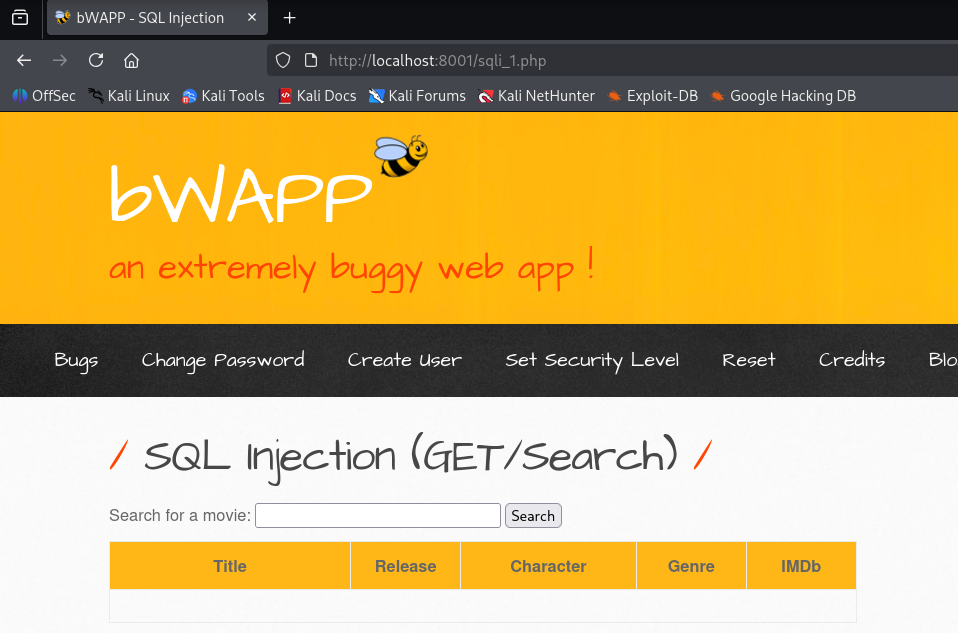
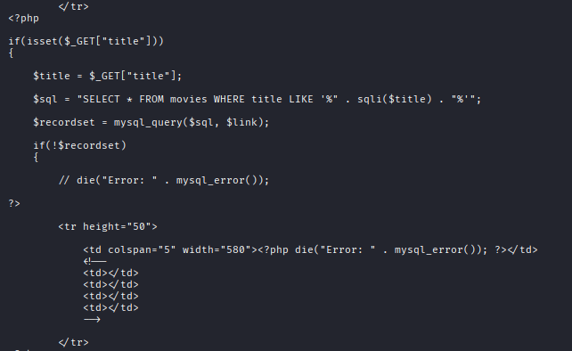
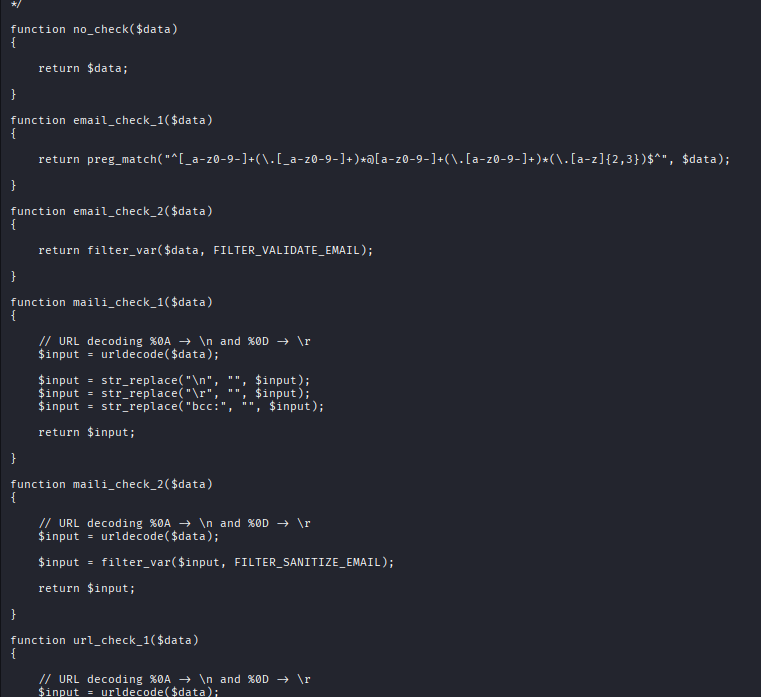
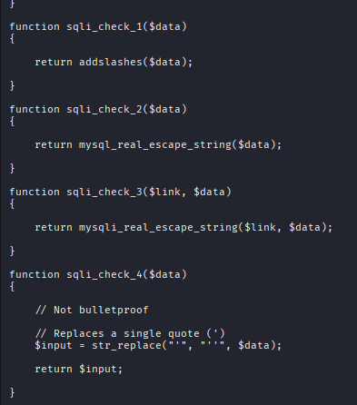

# Análisis de Vulnerabilidad - SQL Injection

## Selección del tipo de ataque

En esta captura se muestra la interfaz donde elegimos el tipo de ataque (SQL Injection) y podemos ver el nombre del fichero vulnerable que será analizado.

## Análisis del código fuente

### Primera inspección del fichero vulnerable

Esta imagen muestra el contenido inicial del fichero vulnerable donde se puede observar la estructura básica del código y las funciones que serán examinadas.

### Segunda inspección - Ejecución de la consulta SQL

Esta captura muestra cómo se ejecuta la consulta SQL contra la base de datos y se procesan los resultados. Se puede observar el bucle que recorre los registros obtenidos y cómo se muestran los datos en la página sin validación adicional.

### Tercera inspección - Consulta SQL vulnerable

Esta imagen muestra la consulta SQL donde se evidencia claramente que **el valor de `$_GET['title']` se concatena directamente dentro del string SQL sin ningún tipo de validación o escapado**, lo que permite la inyección de código SQL.

## Análisis de funciones externas

### Lectura del fichero de funciones

Al hacer `cat` del fichero incluido en `functions_external.php`, se visualizan los métodos completos que el fichero vulnerable estaba llamando, permitiendo entender el flujo completo de la aplicación.

### Funciones de validación disponibles pero no utilizadas

Esta captura muestra varias funciones de validación que existen en el fichero de funciones externas. A pesar de tener estas herramientas disponibles, el código vulnerable no las utiliza, dejando la aplicación expuesta a inyecciones SQL.

## Explicación de las opciones de securización según el nivel de seguridad

En el código analizado el comportamiento de la sanitización depende de la cookie `security_level`, con los valores `0`, `1` y `2`:

- **Nivel 0 — Sin comprobación (no_check):**: retorna el dato tal cual, sin ningún filtrado ni escapado. Esto deja la aplicación completamente vulnerable a inyección SQL.
- **Nivel 1 — Escapado simple (sqli_check_1):**: usa `addslashes()` para añadir barras invertidas antes de comillas simples, dobles, backslash y NUL. Mitiga ataques muy básicos basados en comillas, pero es débil: puede ser eludido en algunas codificaciones multibyte, por técnicas SQL avanzadas o si no se aplica correctamente según el contexto de la consulta.
- **Nivel 2 — Escapado con función de la API de la base de datos (sqli_check_2 / sqli_check_3):**: emplea `mysql_real_escape_string()` (o su variante que recibe el enlace de conexión). Escapa caracteres según la conexión y es más adecuado que `addslashes()`. Sin embargo, depende de usar la API correcta, del juego de caracteres de la conexión y del uso correcto de la extensión (nota: `mysql_*` está obsoleta en PHP moderno). No sustituye a las consultas parametrizadas.
- **Otras variantes (sqli_check_4, etc.):**: por ejemplo reemplazar comillas por `''` puede reducir ciertas inyecciones pero es declarado en el código como "Not bulletproof" (no infalible). Estas soluciones ad-hoc suelen fallar frente a técnicas más sofisticadas.